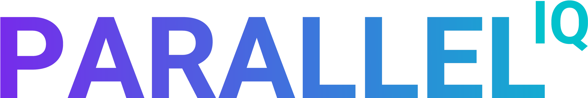

# GenAI Model Deployment Readiness Checklist

A community-driven guide to preparing GenAI models including LLMs, diffusion models, embedding services, and multimodal pipelines for production deployment.  

As AI systems grow more capable and computationally intensive, deploying models reliably has become one of the hardest operational challenges for engineering teams. Unlike traditional microservices, GenAI workloads have unique characteristics batching behavior, memory spikes, warmup cycles, model-specific latency curves, GPU constraints that require their own deployment discipline.

This repository provides a structured checklist to help teams ensure their models are:  
- **performant**  
- **reliable**  
- **observable**  
- **cost-efficient**  
- **safe**  
- **production-ready**  

This checklist is model-type agnostic and applies to:  
- **Large Language Models (LLMs)**  
- **Diffusion and image generation models**  
- **Embedding and retrieval pipelines**  
- **Multimodal models**  
- **Audio, vision, and generative pipelines**  

---

## 📄 Checklist (v0.1)

See the full checklist in [**CHECKLIST.md**](CHECKLIST.md), covering:  
- Model identity  
- Compute & GPU planning  
- Performance objectives  
- Routing & release strategy  
- Autoscaling requirements  
- Observability  
- Reliability  
- Security & compliance  
- Operational metadata  

---

## 🤝 Contributing

We encourage contributions from practitioners across ML, MLOps, DevOps, and infrastructure teams. Feel free to propose:
- new checklist items  
- refinements or clarifications  
- examples for different model families  
- references or documentation  

Open an issue or pull request to get started and share your ideas.

---

## ⭐ Why This Matters

ML deployments today often rely on fragmented knowledge scattered across container configs, CLI arguments, dashboards, and tribal expertise. A shared, community-driven checklist helps create consistency and sets the foundation for better tooling and standards  for example, a future *ModelSpec* that describes model behavior and requirements in a structured, declarative way.

*Thanks for contributing!*

---

  <!-- Animated Logo -->
  

    

  <!-- Social Badges -->
  

  

  

  

    

  <strong>📨 Business Inquiries:</strong> <a href="mailto:sam@paralleliq.ai">sam@paralleliq.ai</a> 
  <strong>👤 Founder & CEO : </strong>Sam Hosseini

   

  <!-- Typing Animation -->
  

CSS Animation Hack (GitHub-safe trick using keyframes inside HTML)

---

