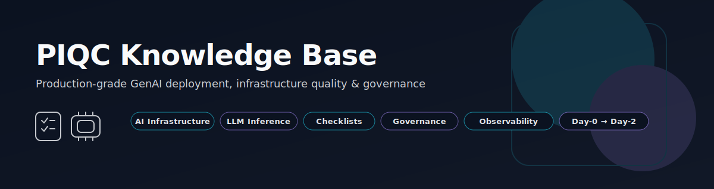

# PIQC Knowledge Base
### GenAI Model Deployment Readiness, Infrastructure Best Practices & Quality Frameworks

  

A curated, community-driven knowledge base covering **production readiness, deployment quality, and operational best practices** for **modern AI / LLM systems**.

This repository is maintained by **ParalleliQ** and serves as a public reference for how real-world AI systems should be deployed, scaled, observed, and governed  **from Day-0 experiments to Day-2 production operations**.

  
  
  
  

---

## 📘 Overview

Deploying Generative AI systems in production is fundamentally different from deploying traditional microservices.

GenAI workloads introduce:
- GPU memory pressure and fragmentation  
- Non-linear batching behavior  
- Long warmup cycles  
- Tail-latency sensitivity  
- Complex autoscaling signals  
- High cost volatility  

These characteristics demand specialized deployment discipline.

The **PIQC Knowledge Base** exists to capture and organize that discipline into **clear, reusable, and community-friendly checklists and frameworks**.

All content is:
- **High-level and conceptual**
- **Framework-agnostic**
- **Infrastructure-neutral**
- **Safe for public discussion**
- **Free of proprietary algorithms**

It provides structured, high-level guidance to help teams ensure their AI systems are:

- **Performant**
- **Reliable**
- **Observable**
- **Cost-efficient**
- **Secure & compliant**
- **Production-ready**

This repository is intentionally **model-type agnostic** and applies to:

- **Large Language Models (LLMs)**
- **Diffusion and image generation models**
- **Embedding and retrieval pipelines**
- **Multimodal AI systems**
- **Audio, vision, and generative pipelines**

---
## 📄 Core Deployment Readiness Checklist

The repository includes a **top-level, model-agnostic readiness checklist** designed for early-stage and pre-production validation.

📄 **AI Model Deployment Checklist (v0.1)**  
📂 [`CHECKLIST.md`](./CHECKLIST.md)

This checklist covers:
- Model identity and constraints  
- Compute & GPU planning  
- Performance objectives  
- Routing and release strategy  
- Autoscaling requirements  
- Observability and reliability  
- Security, compliance, and governance  
- Operational ownership and metadata  

---

## 📚 Knowledge Base Navigation

Use the sections below to explore the full PIQC knowledge base.

### AI Infrastructure Best Practices & Playbooks
Production-oriented guidance for designing, deploying, and operating **efficient, reliable, and cost-optimized AI inference infrastructure**, with a focus on runtime behavior and system-level tradeoffs.  
📂 [`ai-infrastructure-best-practices-and-playbooks/`](./ai-infrastructure-best-practices-and-playbooks/README.md)

### AI Infrastructure Audit & Readiness Checklist (42-Point Review)
A structured, vendor-neutral framework for evaluating **compute health, networking, storage, reliability, scalability, and governance** across AI/ML infrastructure environments.  
📂 [`ai-infrastructure-audit-and-readiness-checklist/`](./ai-infrastructure-audit-and-readiness-checklist/README.md)

### AI Governance & Compliance Checklist
A pragmatic compliance and governance framework covering **AI accountability, data privacy, transparency, fairness, security, and regulatory readiness**, including domain-specific extensions.  
📂 [`ai-governance-and-compliance-checklist/`](./ai-governance-and-compliance-checklist/README.md)

### Model Deployment Quality Checklist
Conceptual diagnostic categories used to evaluate the **correctness, performance, scalability, and cost efficiency** of deployed AI/LLM model services.  
This checklist informs the future direction of **PIQC Advisor** diagnostics.  
📂 [`ai-model-deployment-quality-checklist/`](./ai-model-deployment-quality-checklist/README.md)

### LLM Inference Production Readiness (Kubernetes + vLLM)
A **Day-0 → Day-2, cross-functional readiness framework** for deploying LLMs using **vLLM on Kubernetes**, aligned across ML Engineering, MLOps, SRE, Platform, and Security teams.  
📂 [`llm-inference-production-readiness-checklist/`](./llm-inference-production-readiness-checklist/README.md)

### vLLM Runtime Metrics & Observability Guide
A public, vendor-neutral catalog of **static and dynamic runtime signals** required to analyze GPU efficiency, batching behavior, latency, autoscaling correctness, and runtime drift in vLLM-based inference systems.  
📂 [`vllm-runtime-metrics-and-observability-guide/`](./vllm-runtime-metrics-and-observability-guide/README.md)

---

## 🧭 Purpose & Philosophy

This knowledge base is designed to:

- Promote **industry-wide best practices** for AI infrastructure
- Establish **shared terminology** and evaluation frameworks
- Reduce reliance on fragmented tribal knowledge
- Encourage **community discussion and iteration**
- Serve as a conceptual foundation for tools such as **PIQC Scanner**, **ModelSpec**, and the planned **PIQC Advisor**

> All materials in this repository are **conceptual and high-level**.  
> No proprietary algorithms, scoring logic, heuristics, or advisor implementations are included.

---

## 🤝 Contributing

We encourage contributions from practitioners across **ML, MLOps, DevOps, SRE, and platform engineering**.

You are welcome to propose:

- New checklist items or categories  
- Clarifications and refinements  
- Real-world deployment examples  
- References, documentation, or standards  

Please open an **Issue** or **Pull Request** to get started.

---

## 🏢 Governance & Ownership

This knowledge base is maintained by **ParalleliQ** as part of its open initiative to improve GenAI infrastructure and deployment standards across the industry.

The content is intentionally high-level to:

- Minimize maintenance burden
- Encourage broad adoption
- Avoid exposing proprietary implementation logic

---

## ⭐ Why This Matters

Modern AI deployments often rely on fragmented configuration spread across:
- container images
- orchestration manifests
- CLI flags
- dashboards
- and undocumented operational knowledge

A shared, community-driven knowledge base creates consistency and lays the groundwork for **standardized specifications**, **automated diagnostics**, and **better tooling** across the AI infrastructure ecosystem.

---

  <!-- Company Logo -->
  

    

  <!-- Social & Community Links -->
  
  
  
  

    

  

    <strong>📨 Business Inquiries:</strong>
    <a href="mailto:sam@paralleliq.ai">sam@paralleliq.ai</a>
    &nbsp;•&nbsp;
    <strong>Founder & CEO:</strong> Sam Hosseini
  

   

  <!-- Typing Animation -->
  

---

*Thanks for contributing and helping shape better AI infrastructure standards.*
