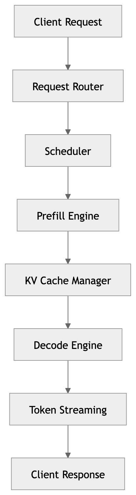
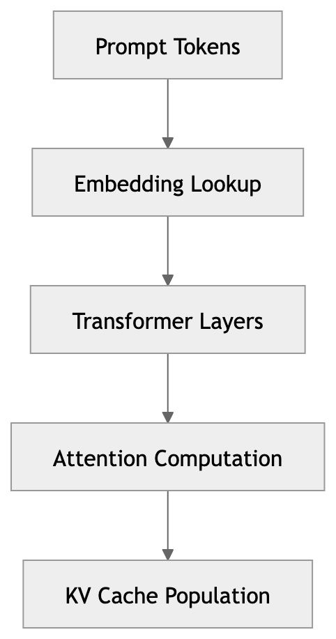
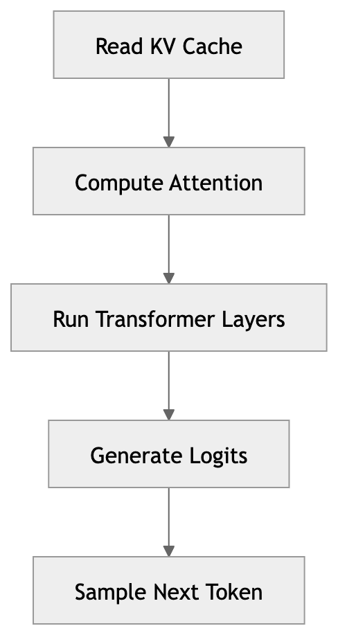

# LLM Inference Architecture

Modern LLM serving systems separate execution into multiple components to efficiently handle prompt processing and token generation.

This architecture is used by many production systems, including:

- vLLM
- TensorRT-LLM
- TGI (Text Generation Inference)
- DeepSpeed-Inference

The goal is to maximize:

- GPU utilization
- throughput
- latency performance

while managing resources such as KV cache and GPU memory.

---

# High-Level Architecture

A typical LLM inference system contains the following components:

*Figure: High-level architecture of an LLM inference system.*

---

# Key Inference Phases

LLM inference has two main phases.

## Prefill Phase

The prefill phase processes the prompt and builds the KV cache.

Tasks performed:

- tokenization
- embedding lookup
- running tokens through transformer layers
- computing attention
- populating KV cache

Important characteristics:

| Property | Description |
|------|-------------|
| Compute pattern | large matrix multiplications |
| GPU usage | high |
| Main metric | TTFT (Time To First Token) |

Optimizations targeting this phase include:

- prefix caching
- context reduction
- FlashAttention
- prompt compression

---

## Decode Phase

The decode phase generates tokens sequentially using the KV cache.

For each generated token:

1. compute query vector
2. read KV cache
3. run transformer layers
4. generate next token
5. append KV entries

Important characteristics:

| Property | Description |
|------|-------------|
| Compute pattern | smaller operations repeated many times |
| Bottleneck | memory bandwidth |
| Main metrics | tokens/sec, inter-token latency |

Optimizations targeting this phase include:

- KV cache optimization
- continuous batching
- speculative decoding
- quantization

---

# Scheduler

The scheduler coordinates requests and determines when they are executed.

Responsibilities include:

- batching requests
- prioritizing latency-sensitive workloads
- assigning requests to GPUs
- maintaining active sequence pools

Optimizations implemented here:

- continuous batching
- request prioritization
- load balancing

---

# Prefill Engine

The prefill engine processes the prompt tokens.

Typical workflow:

*Figure: Prefill phase processes prompt tokens and populates the KV cache.*

Important optimizations in this stage:

- FlashAttention
- prefix caching
- context reduction
- prompt templating

---

# KV Cache Manager

The KV cache stores the **keys and values** produced by transformer attention layers.

Structure:

Layer 1: K1 V1 K2 V2 K3 V3 ...
Layer 2: K1 V1 K2 V2 K3 V3 ...
...
Layer N

Responsibilities:

- storing KV tensors
- allocating memory
- managing sequence growth
- freeing memory when sessions end

Important optimizations:

- paged KV cache
- KV quantization
- KV cache eviction
- prefix KV reuse

---

# Decode Engine

The decode engine generates tokens for active sequences.

Each iteration performs:

*Figure: Decode phase generates tokens sequentially using the KV cache.*

Optimizations in this stage include:

- continuous batching
- speculative decoding
- KV layout optimization
- quantization

---

# Token Streaming

Generated tokens are streamed back to the client.

Streaming is important for:

- chat systems
- coding assistants
- voice pipelines

Streaming reduces perceived latency because the client receives tokens before the full response is complete.

---

# Observability Layer

Production systems track metrics such as:

| Metric | Purpose |
|------|---------|
| TTFT | prompt processing latency |
| tokens/sec | generation throughput |
| GPU utilization | hardware efficiency |
| KV cache usage | memory pressure |
| active sequences | concurrency |

These metrics guide optimization decisions.

---

# Relationship to Optimization Strategies

The following table shows where common optimizations are applied in the architecture.

| Optimization | Component |
|------|-----------|
| Prefix caching | Prefill engine |
| FlashAttention | Prefill engine |
| Context reduction | Prompt processing |
| Continuous batching | Scheduler / Decode engine |
| KV cache optimization | KV cache manager |
| Quantization | Model runtime |
| Speculative decoding | Decode engine |

---

# Control Plane Perspective

In large-scale systems, a control plane may monitor runtime metrics and apply policies such as:

- routing requests based on prompt size
- managing KV cache pressure
- scaling GPU pools
- enabling different inference optimizations

This enables **adaptive model-aware infrastructure** for LLM serving.

---

# Summary

Modern LLM inference systems divide execution into specialized components that manage:

- prompt processing
- KV cache management
- token generation
- request scheduling

This architecture enables efficient serving of large models while supporting advanced optimization techniques.
